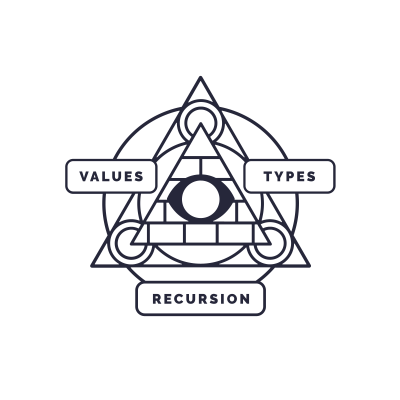

# Haskell MOOC

<p align="center"></p>

University of Helsinki

[Course page](https://haskell.mooc.fi)

[](https://creativecommons.org/licenses/by-sa/4.0/)

This work is licensed under a [Creative Commons Attribution-ShareAlike 4.0 International License](https://creativecommons.org/licenses/by-sa/4.0/).

## About the course

This is an online course on Functional Programming that uses the
Haskell programming language. You can study at your own pace. All the
material and exercises are openly available.

The course is intended to be followed through the [Course
page](https://haskell.mooc.fi), but in case the course page is down or
you want an offline backup, the course material is also available in
this repository ([part1.html](part1.html), [part2.html](part2.html)).

## Exercises

Exercises can be found under `exercises/` directory. All required dependencies
can be downloaded and built with:

```
stack build
```

Exercises are Haskell source code files named `Set1.hs`, `Set2.hs` and so on.
You complete the exercises by editing the file according to the instructions in
the file. You can check your answers by running

```
stack runhaskell SetXTest.hs
```

in the `exercises/` directory. Remember to replace `X` with the number
of the set you are working on.

See [the material](part1.html#working-on-the-exercises) for more info.

## Troubleshooting

Here are some fixes for common problems with `stack build`:

- If you get an error like `While building package zlib-0.6.2.3`, you need to install the zlib library headers. The right command for Ubuntu is `sudo apt install zlib1g-dev`.
- If you get an error like `Downloading lts-18.18 build plan ... RedownloadInvalidResponse`, your version of stack is too old. Run `stack upgrade` to get a newer one.

### Newer GHC version

If you need to use a newer version of GHC, perhaps to get
vscode-haskell to work, try the `ghc-9.6.6` branch of this repository
for GHC 9.6.6. The default for the course is GHC 9.2.8 for now.

Don't forget to run `stack build` again after changing branches.

## Reporting errors

If you notice an error in these materials, you can report it via
- an issue or pull request in this repository (see [CONTRIBUTING.md](CONTRIBUTING.md))
- the course [channel on Telegram](https://t.me/haskell_mooc_fi)
